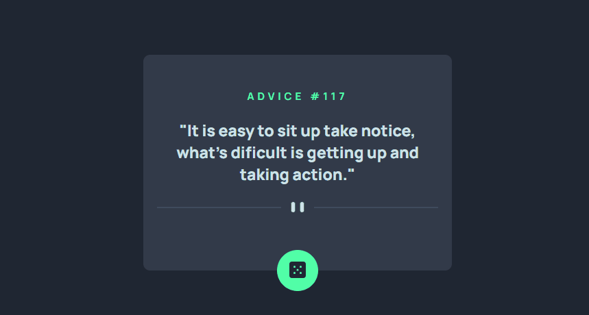

# App gerador de conselhos
Este projeto é baseado em um exercício do Frontend Mentor e foi utilizado no curso de programação Fullstack em JavaScript da DevQuest. O objetivo é criar um aplicativo gerador de conselhos utilizando HTML, CSS e, futuramente, JavaScript.

Inicialmente, o foco é criar um aplicativo gerador de conselhos com HTML e CSS, aplicando boas práticas de responsividade e design, incluindo o uso de media queries e variáveis CSS. Em módulos futuros do curso, o projeto será aprimorado com interatividade através do JavaScript.

## Preview



## Tecnologias Utilizadas

- HTML
- CSS

## Estrutura de Pastas

```
📦 app-gerador-de-conselhos
 ┣ 📂 src
 ┃ ┣ 📂 css
 ┃ ┃ ┣ 📜 reset.css
 ┃ ┃ ┣ 📜 variables.css
 ┃ ┃ ┣ 📜 responsive.css
 ┃ ┃ ┗ 📜 style.css
 ┃ ┣ 📂 design 
 ┃ ┃ ┣ 🖼️ active-states.jpg
 ┃ ┃ ┣ 🖼️ desktop-design.jpg
 ┃ ┃ ┣ 🖼️ desktop-preview.jpg
 ┃ ┃ ┗ 🖼️ mobile-design.jpg
 ┃ ┗ 📂 images
 ┃   ┣ 🖼️ favicon-32x32.png
 ┃   ┣ 🖼️ pattern-divider-mobile.svg
 ┃   ┣ 🖼️ pattern-divider-desktop.svg 
 ┃   ┗ 🖼️ icon-dice.svg
 ┣ 📜 index.html
 ┣ 🖼️ preview.gif
 ┗ 📜 README.md
```

## Como Usar

1. Clone este repositório:

```bash
git clone https://github.com/Alberesbass/app-gerador-de-conselhos.git
```

2. Navegue até o diretório do projeto:

```bash
cd app-gerador-de-conselhos
```

3. Abra o arquivo `index.html` no seu navegador da web.

## Licença

Este projeto está sob a licença MIT. Consulte o arquivo [LICENSE](./LICENSE) para obter mais informações.

---

Desenvolvido por [Alberes](https://github.com/Alberesbass)
